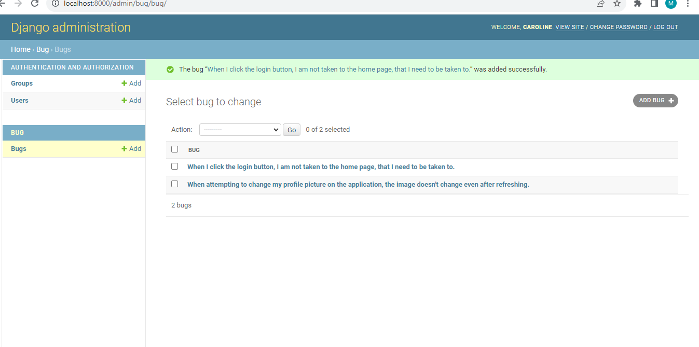

# Django Bug App
This repository contains source code for the Outreachy Wikimedia contribution tasks. The project is written in Django and has one app called bug.

## How to install
This process assumes you have Python installed on your computer.

1. Clone this repository
2. Create a virtual environment
3. Install django using the command `pip install django`
4. Run migrations using the command `python manage.py migrate`
5. Run the server using the command `python manage.py runserver`

## How to add a bug
1. Create a super user using the command `python manage.py createsuperuser`
2. Log into admin dashboard 
3. Add bug

## Screenshot

